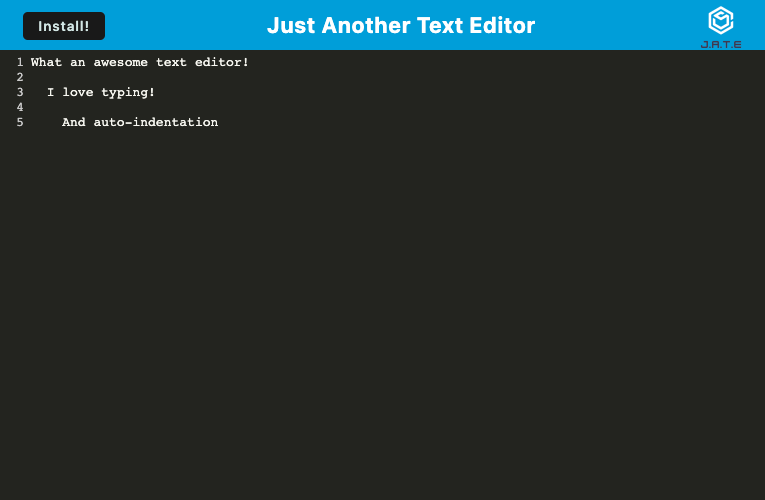

# Text Editor (Progressive Web Application)

## Summary
This is a simple text editor project that should allow an end user to type multiple lines of text, and have the text persist when they revisit the page. This is a progressive web application, and clicking the install button should allow the app to be stored and launched from your local computer. The application uses a combination of IndexedDB (online) and local browser storage (offline) to store the data entered in the text field.

## Technologies and Packages
Express.js is used for routing and nodemon is used for development purposes. IndexedDB is used in conjunction with local storage to preserve data.

## Instructions
If you clone this repository to your computer, the package.json will have ```npm start``` run the build and then launch the server. You can use the Install button in the header if you wish to run the application outside the Heroku deployment.

## Link to Heroku Deployment
Here is a link to the deployed app on Heroku: [Deployed Application](https://pwa-text-editor-jcd.herokuapp.com/)

## Screenshot of Deployed App
